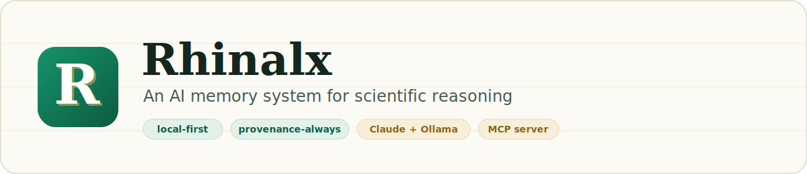
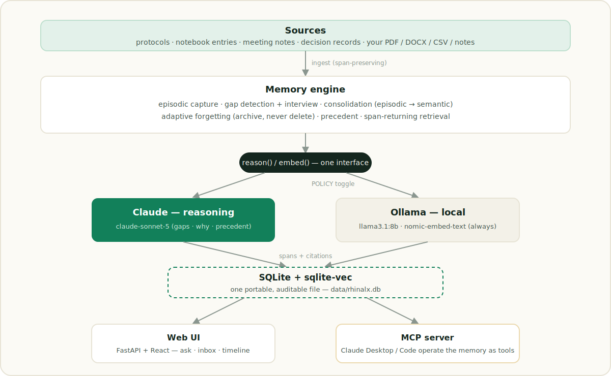

<p align="center">
  
</p>

<h1 align="center">Rhinalx</h1>

<p align="center">
  <em>Laboratories don't lose data. They lose <strong>decisions</strong>.<br/>
  Rhinalx makes scientific reasoning permanent.</em>
</p>

A lab notebook records *what* happened — the dose, the antibody, the cohort, the
date — but almost never *why*: why the dose dropped between cohorts, why an animal
was excluded, why a reagent was swapped. That reasoning lives in the PI's head, in
meeting notes, and in Slack, and it evaporates. Rhinalx captures it as structured,
**source-traceable** memory and answers the two questions that actually bite a
researcher:

1. **"Why did we change this?"** — reconstructs the reasoning behind a decision,
   every claim cited to its exact source span.
2. **"Have we ruled this out before?"** — surfaces precedent so the lab doesn't
   repeat a dead end.

And its signature move: on ingest it **notices rationale that's missing everywhere
in the record and interviews you for it** — an AI collaborator that fills the holes
in the lab's memory before they close. Pure RAG never does this.

Built for the 2026 *Built with Claude: Life Sciences* hackathon (Builder track).

---

## Beyond RAG: an agent, and an agent-ready memory

Rhinalx is not a document chatbot. Two things make it an *agentic memory*:

- **It acts before you ask.** On every ingest it audits the new decisions, and any
  decision recorded without a reason becomes an **Open Question** it puts to you.
  The memory notices its own gaps.
- **It is a tool other agents can hold.** Rhinalx ships an **MCP server** that
  exposes the lab's rationale memory as tools. Point **Claude Desktop** or
  **Claude Code** at it and Claude *becomes* the agent operating over your study —
  listing decisions, reconstructing a cited "why", surfacing precedent, filing a
  missing rationale, grounding any claim to exact source spans. (See
  [The MCP server](#the-mcp-server).)

Everything stays under one trust contract: **no claim without a citation to a
source span**, and Rhinalx refuses — *"insufficient evidence in the record"* —
rather than guess.

---

## The three demo beats

Run against the synthetic Gal-3 / LPS neuroinflammation study in `data/sample/`:

1. **Proactive interview** — Rhinalx detects that cohort 3's notebook records a
   Gal-3 antibody swap (Abcam ab209344 → Novus NBP2-27373) with *no recorded
   reason*, and asks you for it. Your answer is filed as memory, attributed to your
   own words. → **Open Questions**
2. **Cited "why" reconstruction** — *"Why did we drop the LPS dose in cohort 3?"*
   The answer isn't in protocol v3; Claude reconstructs it across the pilot notebook
   (mortality at 1 mg/kg) + the supervisor meeting note (250 µg/kg reported reliable),
   every claim carrying a provenance chip. → **Ask**
3. **Precedent** — *"Have we excluded an animal for this reason before?"* surfaces
   the earlier pilot exclusion (EXC-2024-01) via embeddings, with a Claude-explained
   resemblance, both cases cited. → **Precedent**

Consolidation distils these into a **Knowledge** library; when a decision is
superseded (LPS dose 1 mg/kg → 250 µg/kg) the old rationale is **archived, never
deleted**, and weighted down → **Archive**.

---

## Screenshots

> _Drop three PNGs into [`docs/screenshots/`](docs/screenshots/) — the study
> overview, a cited "why" answer, and the Open Questions inbox — then uncomment the
> block below. See that folder's README for the exact filenames._

<!-- Uncomment once the images exist:
<p align="center">
  <br/><br/>
  <br/><br/>
  
</p>
-->

---

## Use it on your own study

The demo dataset is only a starting point — Rhinalx works on your real records.

- **Ingest sources** (in-app, `/app/ingest`): drop **PDF, DOCX, CSV, TXT, or MD**
  files (parsed server-side with `pypdf` / `python-docx`, still fully local) or paste
  a quick note. Rhinalx reads them, extracts the decisions inside, and raises an Open
  Question for any decision that arrives without a reason — live.
  Freeform notes (no special structure) are extracted by a Claude-backed pass that
  must **quote each decision verbatim**; a quote it can't locate in your text is
  dropped, never fabricated, so provenance stays exact.
- **Start fresh:** *Reset study* empties the live memory so it holds only your data.
  The sample files on disk are untouched and can always be re-seeded.

Because everything runs local-first, unpublished data and unblinded results never
have to leave your machine.

---

## Principles

- **Provenance always.** No claim is asserted without a citation to a source span.
  The store's core invariant is structural: `raw_text[start:end] == span.text`.
- **Local-first.** Ingestion, embeddings, and search run entirely on your machine
  against a single inspectable file (`data/rhinalx.db`). Claude is an opt-in
  enhancement — flip the top-bar toggle to **Local** and the whole loop runs offline
  on Ollama. Every answer shows which backend served it.
- **Forgetting never deletes.** Superseded reasoning is archived and de-weighted,
  fully recoverable. Deleting research history is a disqualifying anti-goal.

---

## Architecture

<p align="center">
  
</p>

Reasoning calls (gap detection, interview questions, "why" assembly, precedent
explanation, consolidation) go to **Claude** when policy allows and fall back to a
**local Ollama LLM** offline. Embeddings are **always local** so retrieval works
with no network. Feature code never branches on backend — it calls one
`reason()` / `embed()` interface, and the backend that served each call is logged
and shown in the UI.

---

## The MCP server

`backend/mcp_server/server.py` exposes the lab's memory over MCP (stdio), so Claude
can operate it directly:

| Tool | What it does |
|---|---|
| `study_overview` | Counts of sources, decisions, rationale, and open gaps |
| `list_decisions` | Every captured decision with source + date |
| `why_was_decided` | Cited "why" reconstruction (refuses if insufficient) |
| `find_precedent` | Prior resembling decision + Claude-explained resemblance |
| `list_open_questions` | Decisions recorded with no reason |
| `answer_open_question` | File the scientist's reason as provenance-bound memory |
| `ground_claim` | Exact source spans a claim rests on |
| `ingest_note` | Add a note in real time; raise gaps for missing rationale |

Run it standalone:

```bash
uv run python -m backend.mcp_server.server
```

Register it in Claude Desktop (`claude_desktop_config.json`):

```json
{
  "mcpServers": {
    "rhinalx": {
      "command": "uv",
      "args": ["run", "python", "-m", "backend.mcp_server.server"],
      "cwd": "<absolute path to this repo>"
    }
  }
}
```

Then ask Claude, e.g., *"Using rhinalx, why did we drop the LPS dose in cohort 3,
and has this exclusion pattern happened before?"* — and watch it call the tools.

---

## Quickstart

Prerequisites: [uv](https://docs.astral.sh/uv/), Node.js, and
[Ollama](https://ollama.com/) running locally.

```bash
# 1. models (embeddings always local; llama3.1 is the offline reasoning fallback)
ollama pull nomic-embed-text
ollama pull llama3.1:8b

# 2. config — copy and add your key (optional; without it, runs fully local)
cp .env.example .env      # set ANTHROPIC_API_KEY, POLICY=claude|local

# 3. deps
uv sync
npm --prefix frontend install

# 4. one command: start the backend + UI (boots EMPTY — ingest your own sources)
uv run python scripts/demo.py            # add --seed to load the sample study (the demo)
```

Then open **http://localhost:5173** and ingest your first source at
`/app/ingest`. The API is on `http://localhost:8000`.

Run the pieces separately if you prefer:

```bash
uv run uvicorn backend.main:app --port 8000   # API (starts empty)
npm --prefix frontend run dev                 # UI on :5173
uv run python scripts/seed.py                 # optional: load the sample study
uv run pytest                                 # provenance round-trip tests
```

---

## Repo layout

```
rhinalx/
  backend/
    main.py               FastAPI app + routes (incl. /ingest, /reset)
    ingest.py             span-preserving ingest + episode extraction
                          (deterministic + Claude-backed freeform)
    inference/            reason()/embed() router: Claude | Ollama, logged
    memory/               store · interview · consolidate · forget ·
                          precedent · retrieve (the memory engine)
    mcp_server/           the MCP server — memory as Claude tools
  frontend/               React + Vite + TypeScript + Tailwind (workspace + landing)
  data/sample/            the demo dataset (see its README for the provenance map)
  scripts/                seed.py (build memory) · demo.py (one-command run)
  tests/                  provenance round-trip tests
```

---

## Stack

Python 3.11 · FastAPI · SQLite + sqlite-vec (single-file store) · Ollama
`nomic-embed-text` (embeddings, always local) + `llama3.1:8b` (offline reasoning
fallback) · Anthropic Claude (`claude-sonnet-5`) for the reasoning path, routed
through one `backend/inference/router.py` · Model Context Protocol (`mcp`) server ·
React + Vite + TypeScript + Tailwind.

## Architecture decisions

**Why not LlamaIndex / LangGraph / Mem0?** Rhinalx deliberately does *not* build on a
RAG or agent-memory framework, because its core properties are ones those frameworks
abstract away:

- **Character-span provenance, not chunk provenance.** Frameworks retrieve *chunks*
  ("here's the passage this came from"). Rhinalx's contract is stronger: every claim
  maps to an exact character offset, enforced structurally as
  `raw_text[start:end] == span.text` and covered by tests. Threading verbatim offsets
  back through opaque framework nodes fights the abstraction.
- **A typed memory model, not generic retrieval.** The domain is Episodes (decisions)
  → ConsolidatedRationale (semantic layer) → OpenQuestions (detected gaps) →
  supersede/archive with retrieval weights. That's not "store chunks, fetch chunks"
  (LlamaIndex) or conversation/agent state (LangGraph memory) — it's a small,
  purpose-built schema.
- **One portable, auditable file.** A single inspectable SQLite artifact is a trust
  property for a scientist; heavier framework storage backends work against it.

The trade-off is real — we forgo LlamaIndex's data connectors and LangGraph's agent
orchestration. We don't need the former for the core loop, and the **MCP server**
supplies the latter in a cleaner, Claude-native form. (Note: Rhinalx *does* use
**Ollama** — the local model runtime — for embeddings and the offline fallback; that
is distinct from **LlamaIndex**, the RAG framework, which it does not use.)

## Scope

By design Rhinalx is **not** a transcription/scribe product, a general document
chatbot, or a cloud service. It has no accounts or multi-tenancy. It answers *why*,
finds *precedent*, and asks for *missing rationale* — and it never deletes research
history.

MIT licensed.
